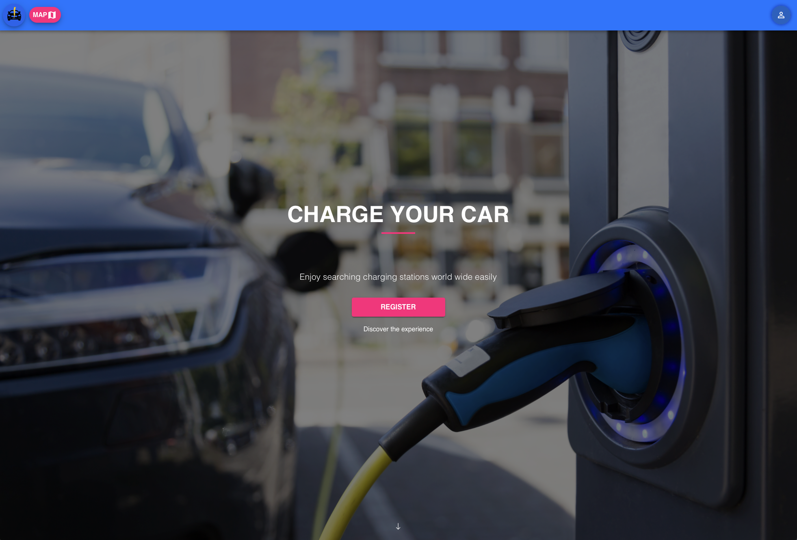

<!-- PROJECT LOGO -->
<br />
<div align="center">
  <a href="https://github.com/github_username/repo_name">
    
  </a>

<h3 align="center">Charging Stations</h3>

  <p align="center">
    This is our Charging Stations Map Frontend! You can see all the Charging Stations with our Application.
    <br />
    <br />
    <a href="https://ev-map.de">View Demo</a>
    
  </p>
</div>


<!-- TABLE OF CONTENTS -->
<details>
  <summary>Table of Contents</summary>
  <ol>
    <li>
      <a href="#about-the-project">About The Project</a>
      <ul>
        <li><a href="#built-with">Built With</a></li>
      </ul>
    </li>
    <li>
      <a href="#getting-started">Getting Started</a>
      <ul>
        <li><a href="#prerequisites">Prerequisites</a></li>
        <li><a href="#installation">Installation</a></li>
      </ul>
    </li>
    <li><a href="#frontend-and-backend-urls">Frontend and Backend URLs</a></li>
    <li><a href="#microservice-endpoints">Microservice endpoints</a></li>
    <li><a href="#responsibilities-of-each-teammember">Responsibilities of each team member</a></li>
    <li><a href="#additional-detail">Additional Details</a></li>
  </ol>
</details>


<!-- ABOUT THE PROJECT -->
## About The Project




This is our project done in galvanize school. We are displaying all the available charging stations in germany for the time being.

<p align="right">(<a href="#top">back to top</a>)</p>


### Built With
Frontend:
* [React.js](https://reactjs.org/)
* [Leaflet Map](https://react-leaflet.js.org/)
* [Material UI](https://mui.com)
<br />

Backend
* [Java](https://www.java.com/)
* [Spring](https://spring.io/)
* [Gradle](https://gradle.org/)
<br />

Database
* [PostgreSQL](https://www.postgresql.org/)
<br />

Dataprovider
* [OpenChargeMap](https://openchargemap.org/)
<br />

Deployment
* [Microsoft Azure](https://azure.microsoft.com/)


<p align="right">(<a href="#top">back to top</a>)</p>


<!-- GETTING STARTED -->
## Getting Started

Here is a quick guide to setup your environment and start the web app.

### Prerequisites

npm is required to run this app.
* npm
  ```sh
  npm install npm@latest -g
  ```

### Installation

1. Clone the repo
   ```sh
   git clone https://github.com/Forsa1997/Charging-Stations-Frontend.git
   ```
2. Switch to the repo folder
   ```sh
   cd Charging-Stations-Frontend/
   ```
3. Install NPM packages
   ```sh
   npm install
   ```
4. Start the app
   ```js
   npm start
   ```

<p align="right">(<a href="#top">back to top</a>)</p>


<!-- FRONTEND AND BACKEND URLs -->
## Frontend and Backend URLs

* Running web app url: https://ev-map.de or https://icy-flower-043c43d03.1.azurestaticapps.net
* Frontend repo: https://github.com/Forsa1997/Charging-Stations-Frontend
* Microservice (backend) repo: https://github.com/Forsa1997/Charging-Stations-Backend

<p align="right">(<a href="#top">back to top</a>)</p>


<!-- MICROSERVICE ENDPOINTS -->
## Microservice endpoints

* Register: https://charging-stations-backend.azurewebsites.net/register
* Login: https://charging-stations-backend.azurewebsites.net/login
* Stations: https://charging-stations-backend.azurewebsites.net/stations
* Filter: https://charging-stations-backend.azurewebsites.net/filter

<p align="right">(<a href="#top">back to top</a>)</p>


<!-- RESPONSIBILITIES OF EACH TEAM MEMBER -->
## Responsibilities of each Team member

* [Kaan](https://github.com/kaano29): Did most of the Frontend Design, helped with the deployment to azure and the backend.
* [Nicolas](https://github.com/nicodewel): Did some Frontend, helped with the deployment to azure and created the backend.
* [Christoph](https://github.com/Forsa1997): Did some Frontend, helped with the deployment to azure and created the backend.

<p align="right">(<a href="#top">back to top</a>)</p>


<!-- ADDITIONAL DETAILS -->
## Additional details

We invested much time into making the Application performant. Because we have so much data, we had big problems at the beginning.
Most of the calculation is done by the backend, like api calls to the datasource and refining the result to ensure the frontend works fast.
<br />
Our web application is full responsive and supports all devices with any size.

<p align="right">(<a href="#top">back to top</a>)</p>
